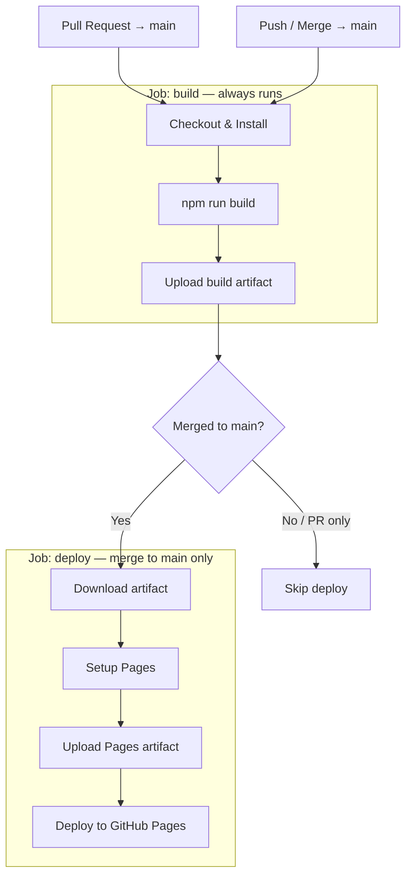

# septimaola

This repository contains the marketing materials and promotional content for the "Septima Ola" reggae band.

## Deployment

The React app (`react/`) is deployed to **GitHub Pages** via a two-job CI/CD pipeline defined in [`.github/workflows/deploy.yml`](.github/workflows/deploy.yml).

### Pipeline Overview

### Trigger Matrix

| Event | `build` job | `deploy` job |
|---|---|---|
| PR opened / updated targeting `main` | runs | skipped |
| Push / merge into `main` | runs | runs |

### How it works

1. **Every PR to `main`** runs the `build` job — installs dependencies and compiles the Vite app — so broken builds are caught before merge.
2. **On merge to `main`**, the `deploy` job picks up the compiled artifact, configures GitHub Pages, and publishes the site.
3. The two jobs share the compiled output via `actions/upload-artifact` / `actions/download-artifact`, keeping the deploy job free of Node.js setup.

## Cursor

* [Cursor Rules](https://cursor.com/docs/context/rules)
